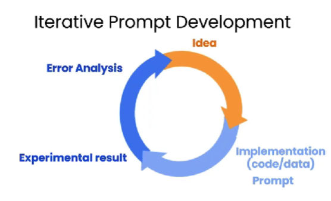

# 3.Iterative

iterative prompt development

## 3.1.try to control the length of the output
Use at most 50 words.
52 words.
// Not that great at following instructions about a very precise word count.
// Sometimes it will print out something with 60 or 65 and so on words, but it's kind of within reason.

Use at most 3 sentences.
Use at most 280 characters.
281 characters.
// It's actually surprisingly close.

## 3.2.extract specific details

## 3.3.Output in HTML format
